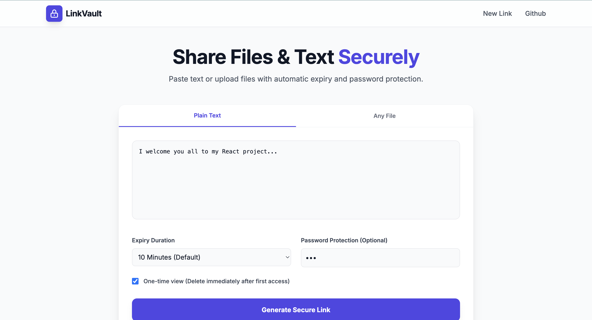
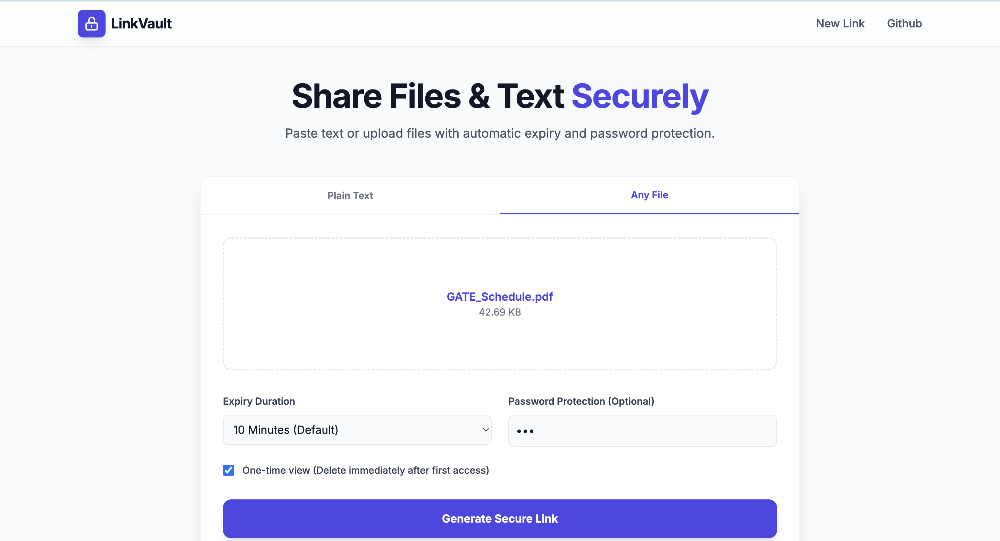
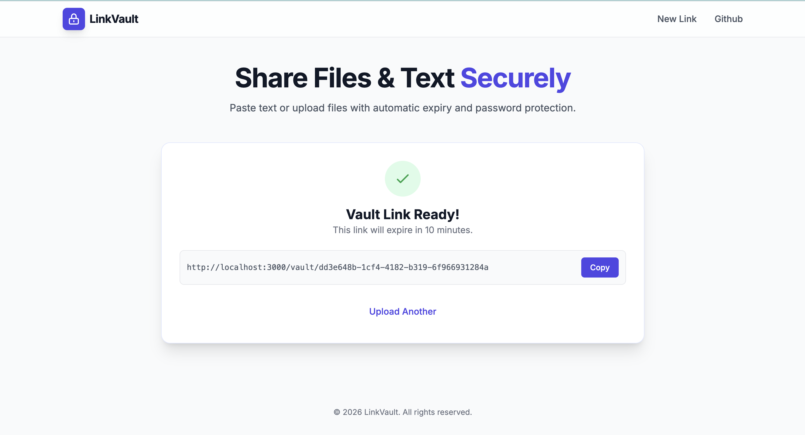

# LinkVault

Secure file and text sharing with controlled access and automatic expiry.


LinkVault is a full-stack application that allows users to share plain text or files through a generated private link. Each vault link supports expiry controls, optional password protection, and one-time access.

The system is built with clear separation between client and server, ensuring that storage credentials and validation logic remain strictly backend-controlled.


## Overview


LinkVault enables:

* Text sharing via secure link
* File uploads with backend-managed storage
* Default 10-minute expiry (configurable)
* Optional password protection
* One-time view links
* Strict access via unique vault ID

There is no public listing or searchable index of uploaded content.


## Product Interface


### Create a Secure Link

Users can choose between plain text and file uploads. Expiry duration, optional password, and one-time access can be configured before generating the vault link.

<p align="center">
  
</p>


### File Upload Support

Files are uploaded securely through the backend and stored in a private Supabase bucket. The frontend does not interact directly with storage credentials.

<p align="center">
  
</p>


### Generated Vault Link

After successful creation, a unique link is returned. Expiry details are displayed, and the link can be copied directly.

<p align="center">
  
</p>


## Architecture


LinkVault follows a client–server model:

```
User
  ↓
React Client (Port 3000)
  ↓
Express API (Port 4000)
  ↓
Supabase Storage (Files)
Supabase PostgreSQL (Metadata)
```

All validation, upload handling, expiry enforcement, and deletion logic reside on the backend.

The frontend never receives the Supabase service role key.


## Application Flow


### Upload Flow

1. User selects text or file.
2. Expiry, password, and one-time options are configured.
3. Frontend sends a `FormData` request to the backend.
4. Backend:

   * Uploads file to Supabase Storage (if applicable)
   * Stores metadata in PostgreSQL
   * Applies default expiry if none is provided
5. A unique vault ID is returned.


### Access Flow

1. User opens the vault link.
2. Backend validates:

   * Vault existence
   * Expiry timestamp
   * Password (if required)
3. Content is returned.
4. If marked as one-time:

   * Storage file is deleted
   * Database entry is removed


## Technology Stack


### Frontend

* React (TypeScript)
* Vite
* React Router
* Tailwind CSS

### Backend

* Node.js
* Express
* TypeScript
* Multer (in-memory file handling)

### Database & Storage

* Supabase PostgreSQL
* Supabase Storage (private bucket)
* Service Role key (server-side only)


## Database Schema


Table: `items`

```
id            uuid (primary key)
type          text ('text' | 'file')
content       text (nullable)
file_path     text (nullable)
file_name     text (nullable)
mime_type     text (nullable)
password      text (nullable)
expires_at    timestamptz
is_one_time   boolean
view_count    integer
created_at    timestamptz
```


## API Overview


### Create Vault

```
POST /api/vault/create
```

FormData fields:

* `type` → text | file
* `content`
* `file`
* `password` (optional)
* `expires_at` (optional)
* `is_one_time`


### Retrieve Vault

```
GET /api/vault/:id
```


### Download File

```
GET /api/vault/:id/download
```

If one-time is enabled, cleanup occurs after successful response.


## Setup Instructions


### Clone Repository

```
git clone https://github.com/your-username/linkvault.git
cd linkvault
```


### Supabase Setup

1. Create a new Supabase project.
2. Create a private storage bucket named:

```
vault
```

3. Create the `items` table using the schema above.
4. Obtain:

   * `SUPABASE_URL`
   * `SUPABASE_SERVICE_ROLE_KEY`

Do not expose the service role key to the frontend.


### Backend Setup

```
cd server
npm install
```

Create `.env`:

```
SUPABASE_URL=your_project_url
SUPABASE_SERVICE_ROLE_KEY=your_service_role_key
PORT=4000
```

Start server:

```
npm run dev
```

Runs at:

```
http://localhost:4000
```


### Frontend Setup

```
cd client
npm install
npm run dev
```

Runs at:

```
http://localhost:3000
```


## Security Considerations


* Service role key is strictly backend-only.
* Files are never publicly exposed.
* Expired vaults are inaccessible.
* No public browsing or indexing.
* One-time vaults are permanently removed after access.


## Design Decisions


* UUID-based vault IDs to reduce predictability.
* Backend-enforced default expiry.
* Clear separation of upload middleware and route logic.
* In-memory file handling to avoid disk writes.
* Centralized validation for access control.


## Author

Harsh Jain


